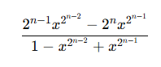

# Solution Approach

The series showed bellowed:

Follows the pattern:

So we just need to code an algorithm to compute the pattern above from i = 1 until we find a good result

The algorithm's code can be found [here](solution.c)
