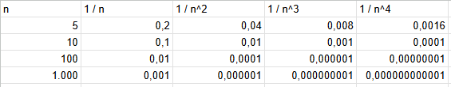

# Solution 

## A) Suppose that 0 < q < p and that αn = α + O(n^(-p)). Show that αn = α + O(n^(-q))  
If q < p and both q and p are positive, then 1/q > 1/p. As we use the upper bound for Big O Notation, O(1/q) is preferred compared to O(1/p).

## B) Make a table listing 1/n, 1/n^2, 1/n^3, and 1/n^4 for n = 5, 10, 100, and 1000, and discuss the varying rates of convergence of these sequences as n becomes large

As we can see, all sequenes tend to zero but for 1 / n^k, as k increase in it's value, the sequence gets closer to 0 faster. For k = 1, the sequence tends to 0 linearly, for k = 2,3,4 it decreases to 0 in quadratic,cubic and quartically, respectively.