# Exercises:

Selecting the exercise number will redirect the page to the solution.

[Exercise 01](Ex_1/)

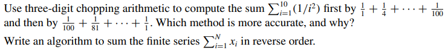

[Exercise 02](Ex_2/)

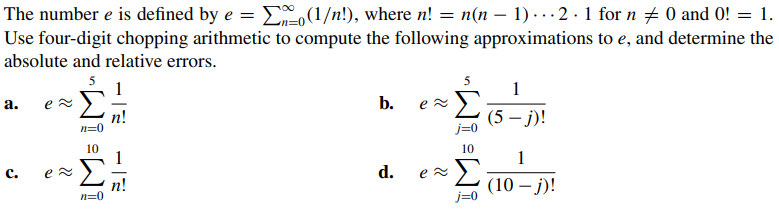

[Exercise 03](Ex_3/)

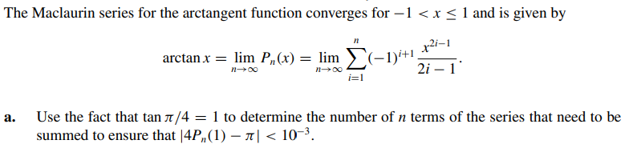

[Exercise 04](Ex_4/)

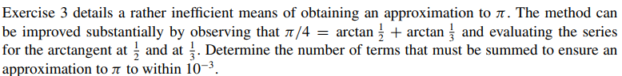

[Exercise 05](Ex_5/)

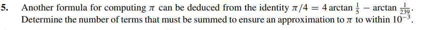

[Exercise 06](Ex_6/)

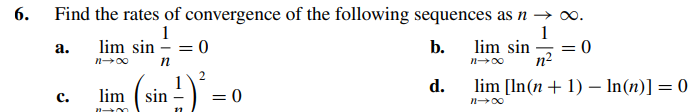

[Exercise 07](Ex_7/)

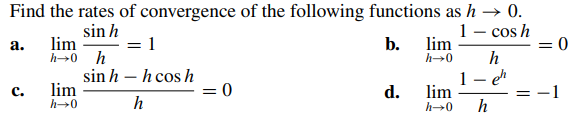

[Exercise 08](Ex_8/)

[Exercise 09](Ex_9/)

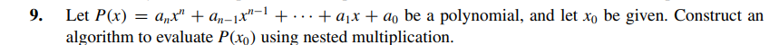

[Exercise 10](Ex_10/)

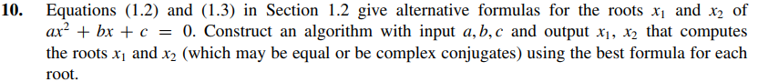

[Exercise 11](Ex_11/)

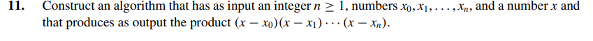

[Exercise 12](Exa_12/)

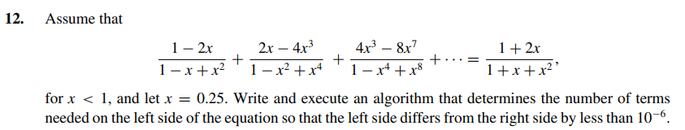

[Exercise 13](Exa_13/)

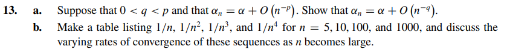

[Exercise 14](Exa_14/)

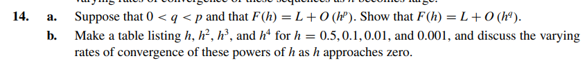

[Exercise 15](Exa_15/)

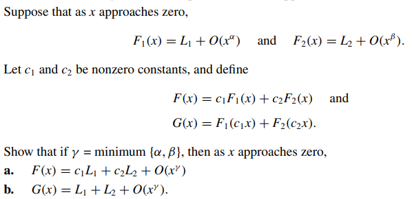

[Exercise 16](Ex_16/)

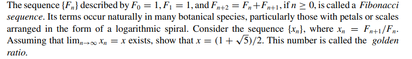
