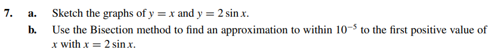
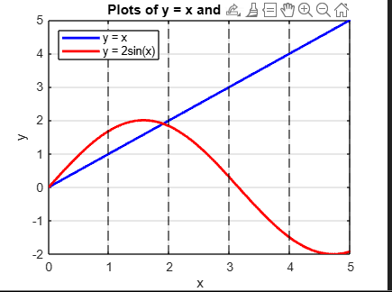

# Exercise 07

## Plotting functions y = x and z = 2sin(x)

## Finding the first positive value of x which x = 2sin(x) , within 0.000001, with Bisection Method

We can see that the value of x we want is between 0 and 5. So let's use bisection technique in this interval

[solution](ex07.c)
