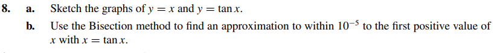
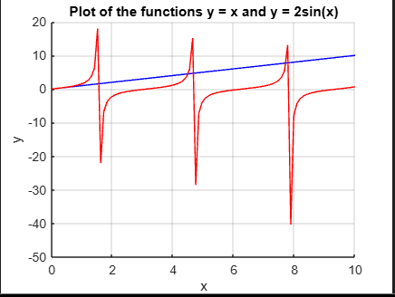

# Exercise 08

As we can see in the plot, the 1st positive value of x which x = tan(x) is within the range (0,2)
So let's find the exact value of x that satis fies that condition with C programming Language ---> [C programm](ex08.c)