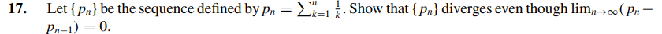

# Exercise 17 

## Solution

From Calculus II we know that a sequence g(x) approximate to a number n such that

F(t) - F(1) = n, where t -> infinite and F'(x) = g(x)

As g(x) = 1/x, we have F(x) = ln(x). So...

n = ln(inifinte) - ln(') = infinite

That shows why the harmonic series is divergent