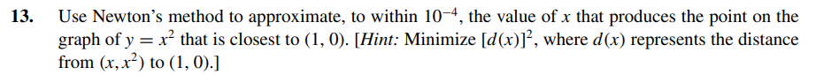

# Exercise 13

The distance between (x,x^2) and (1,0) is [d(x)] ^2 = (x - 1) ^2 + x^4 = x^4 + x^2 - 2x + 1

If f(x) = x^4 + x^2 - 2x + 1, then f'(x) = 4x^3 + 2x - 2

The minimum point of f(x) is x for which f'(x) = 0.

So we'll use newton method to find x which 4x^3 + 2x - 2 = 0 [in this code](ex13.c).