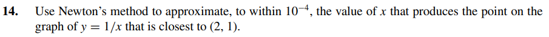

# Exercise 14

The distance between the point \( (2,1) \) and the point \( (x, 1/x) \) is

$$
D(x) = \sqrt{(x - 2)^2 + \left(\frac{1}{x} - 1\right)^2}
$$

Simplifying:

$$
D(x) = \sqrt{x^2 - 4x + \frac{1}{x^2} - \frac{2}{x} + 5}
$$

Squaring both sides to simplify further:

$$
D(x)^2 = x^2 - 4x - \frac{2}{x} + \frac{1}{x^2} + 5
$$

Let's use **Newton's Method** to find the value of \( x \) at which \( D(x) \) is minimized. Check the implementation [here](ex14.c).

