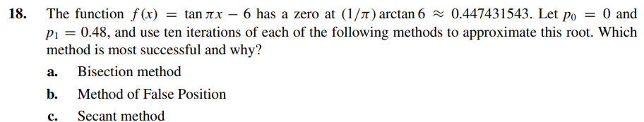

# Exercise 18

Code Implementation here -----> [ex18.c](ex18.c)

As in the code is:

Bisection Method Root: 0.4476562500
False Position Method Root: 0.4441206618
Secant Method Root: -3024.2620795773

We can conclude the Bisection Method was more accurate