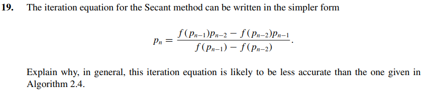

The numerator of this alternative equation subtracts numbers that are too close when Pn-1 and Pn-2 are near, so it will give a 0/0, because numerator and denominator are subtractions of nearly equal numbers.
