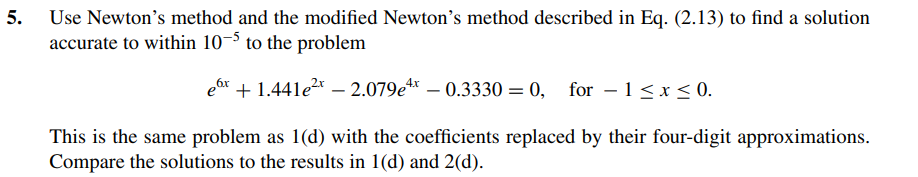

# Exercise 05

## Solution: 
In the exercise 1(d) the solution was x = -0.20572. 
With the following code [ex05.c](ex05.c) with differente coefficients we achieved the output: 

    Maximum iterations reached for Standard Newton Method. Last x = -nan(ind)
    Newton Method Solution: -nan(ind)

    Maximum iterations reached for Modified Newton Method. Last x = -0.0762213369
    Modified Newton Method Solution: 0.00000