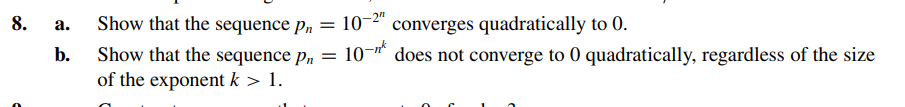

# Exercise 08

## Solution Letter A:
To prove that $\ p_{n} = 10^{-(2^n)}$ converges quadratically to 0 we have to show that $\alpha = 2$ such that:

$$
\ |\ p_{n+1} | \leq C \cdot | \ (p_{n})^{\alpha} |
$$

As $\ p_{n} = 10^{-(2^n)} = \frac{1}{10^{2^n}}$ , the equation becomes:

$$
\ | \frac{1}{10^{2^{n+1}}} | \leq C \cdot |\ p_{n}|^{\alpha}
$$

$$
\ | \frac{1}{10^{2^{n+1}}} | \leq C \cdot |\ p_{n}|^{\alpha}
$$

$$
\ | \frac{1}{10^{(2*2^n)}} | \leq C \cdot |\ p_{n}|^{\alpha}
$$

$$
\ | \frac{1}{(10^{2^{n}})^2} | \leq C \cdot |\ p_{n}|^{\alpha}
$$

$$
\ | (10^{-2^{n}})^{2} | \leq C \cdot |\ p_{n}|^{\alpha}
$$

$$
\ | p_{n} |^{2}  \leq C \cdot |\ p_{n}|^{\alpha}
$$

$$
\alpha = 2
$$

It's proven that the sequence converges quadratically as $\alpha = 2$

## Solution Letter B:

Let's show that $\ p_{n} = 10^{-n^{k}}$ does not converge quadratically.

First, the order of convergence is $ \alpha$ which:
$$
\ | p_{n+1} - p | \leq C \cdot | p_{n} - p |^{\alpha}
$$

As $\ p_{n} \to 0$ when n $ \to \infty$

$$
\ | p_{n+1} | \leq C \cdot | p_{n} |^{\alpha}
$$

$$
\ | 10^{-(n+1)^{k}} | \leq C \dot | p_{n} |^{\alpha}
$$

$$
\ | \frac{1}{10^{(n+1)^{k}}} | \leq C \dot | p_{n} |^{\alpha}
$$

$$ 
| \frac{1}{(10^{n} \cdot 10^{1})^{k}} | \leq C \dot | p_{n} |^{\alpha}
$$

$$
| \frac{1}{10^{n^{k}} \cdot 10^{k}} | \leq C \dot | p_{n} |^{\alpha}
$$

$$
| 10^{-n^{k}} \cdot 10^{k} | \leq C \dot | p_{n} |^{\alpha}
$$

As $\ p_{n} = 10^{-n^{k}}$ , we can conclude that:

$$
| \ p_{n} \cdot 10^{k} | \leq C \dot | p_{n} |^{\alpha}
$$

$$
\ C = 10^{k} , \alpha = 1
$$

As $\alpha = 1$, the sequence does not converge quadratically.