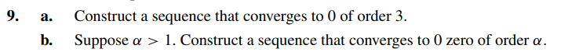

# Exercise 09

## Solution Letter A:

Let $\ p_{n} = 10^{-3^{n}}$. Then the sequence will converge at order 3 if $\alpha = 3$, such that:

$$
| \ p_{n+1} | \leq C \cdot | p_{n} |^\alpha
$$

$$
| 10^{-3^{n+ 1}} | \leq C \cdot | p_{n} |^\alpha
$$

$$
| 10^{-3 \cdot 3^{n} } | \leq C \cdot | p_{n} |^\alpha
$$

$$
| (10^{-3^{n}})^{3} | \leq C \cdot | p_{n} |^\alpha
$$

$$
| p_{n} |^{3} \leq C \cdot | p_{n} |^\alpha
$$

$$
\   C = 1 , \alpha = 3
$$

As $\alpha = 3$ , the sequence converges at order 3.

## Solution Letter B:

Let's find a sequence that converges at order $\alpha$.

Let $\ p_{n} = 10^{- \alpha ^{n}}$. Then:

$$
| \ p_{n + 1} | = | 10^{-\alpha^{n+1}} |
$$

$$
| \ p_{n + 1} | = | 10^{-\alpha^{n} \cdot \alpha^{1}} |
$$

$$
| \ p_{n + 1} | = | (10^{-\alpha^{n}})^{\alpha} |
$$

$$
| \ p_{n + 1} | = | \ p_{n} |^{\alpha}
$$

The sequence $\ p_{n} = 10^{- \alpha ^{n}}$ converges to 0 at order $\alpha$