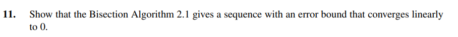

# Exercise 11

## Solution:

In the Bisection Algorithm, the $\ Nth$ term of the sequence is:
$$
\   p_{n} = (\frac{b_{0} - a_{0}}{2^{n}})
$$

To prove it converges linearly, we do:
$$
\   | p_{n+1} | \leq C \cdot | p_{n} |^{\alpha} 
$$

$$
\   | \frac{(b_{0} - a_{0})}{2^{n+1}} | \leq C \cdot | p_{n} |^{\alpha}
$$

$$
\   | \frac{b_{0} - a_{0}}{2^{n}\cdot 2} | \leq C \cdot | p_{n} |^{\alpha}
$$

$$
\   | \frac{b_{0} - a_{0}}{2^{n}}| \cdot | \frac{1}{2}| \leq C \cdot |p_{n}|^{\alpha}
$$

$$
\   | p_{n} | \cdot | \frac{1}{2}| \leq   C \cdot |p_{n}|^{\alpha}
$$

$$
C = \frac{1}{2} , \alpha = 1
$$

As $\alpha = 1$, the Bisection Method converges linearly