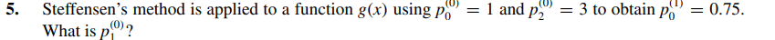

# Exercise 05

## Solution:

The Steffensen's Method uses the Sequence:
$$
    P_{0}^{1} = P_{0}^{(0)} - \frac{(P_{1}^{(0)} - P_{0}^{(0)})^{2}}{(P_{2}^{(0)} -2 \cdot P_{1}^{(0)} + P_{0}^{(0)})}
$$

Replacing the values given by the question:
$$
    0.75 = 1 - \frac{(P_{1}^{(0)} - 1)^{2}}{(3 - 2 * P_{1}^{(0)} + 1)}
$$

The result...

$$
P_{1}^{(0)} = 1.5 
$$
or
$$
 P_{1}^{(0)} = 0
$$