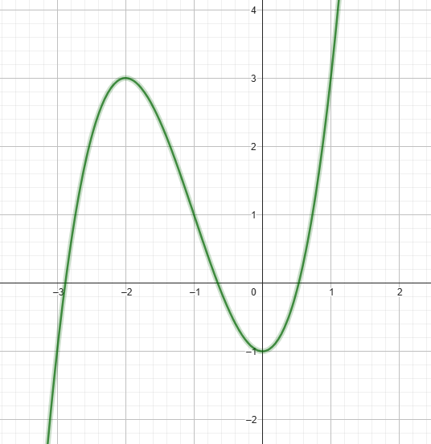

# Exercise 1b

As the plot bellow shows, there are 3 roots for the equation between the intervals [0,1], [0,-1] and [-3,-2]

Output of the *[code in C language that solves the exercise(click here)](ex01b.c)*:
    
    Newton Method Executed Successfully after 5 iteractions
    Root of the equation between 0 and 1 for p0 = 1.00000: 0.53209

    Newton Method Executed Successfully after 3 iteractions
    Root of the equation between 0 and -1 for p0 = -1.00000: -0.65270

    Newton Method Executed Successfully after 3 iteractions
    Root of the equation between -3 and -2 for p0 = -3.00000: -2.87939
