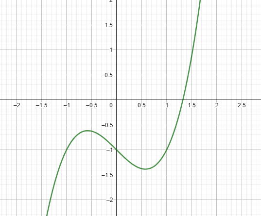

# Exercise 1c

As the plot bellow shows, the root of the equation must be between 1 and 1.5

Output of the *[code in C language that solves the exercise(click here)](ex01c.c)*:
    
    Newton Method Executed Successfully after 20 iteractions
    Root of the equation for p0 = 0.50000: 1.32472