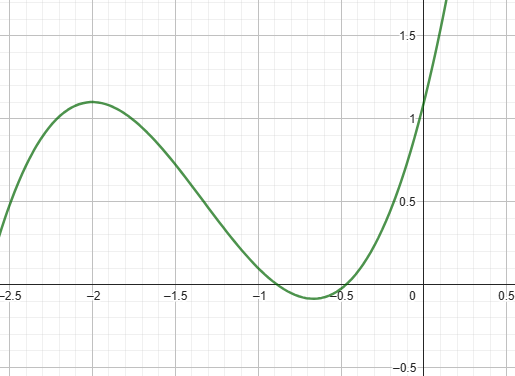

# Exercise 1e

As the plot bellow shows, the root of the equation must be between -1 and -0.5

Output of the *[code in C language that solves the exercise(click here)](ex01e.c)*:
    
    Newton Method Executed Successfully after 43 iteractions
    Root of the equation for p0 = -0.25000: -0.46932