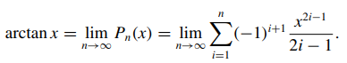
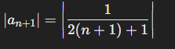
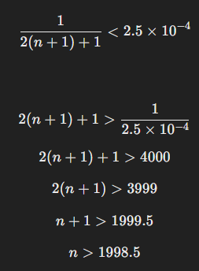

Taylor Series and Truncation Errors

## Approach
We need to find the number n of iteractions to find arctang(1) such that:
|4Pn(1) − π| < 0.001.

From Calculus 2, it's known that 

As the series above is convergent, we know the relation truncation error is close to the next term of the sum.
So if we have A which is the limit of the sum and any term An, we know that the error is approximately A(n+1):

We need to find n so that: |4Pn(1) − π| < 0.001. Where Pn(1) is the arctang(1) = π/4
So basically, we are going to find out how many iteractions we need to compute the approximated value of π/4
with precision 0.001.

From the truncation error, we need to find n such that:
| 4 * A(n+1) - π| < 0.001 --------> |A(n+1)| < 0.001 / 4 ---------> |A(n+1) - π| < 2.5 * 0.0001

In other words, we need the next term (n+1)th to be less than 2.5*0.0001

As the next term is 1 / 2(n+1) - 1, we have: 

The number n of iteractions to find π is close to 2000
