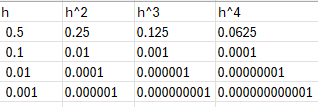

# Solution

## A) Let's show that for F(h) = L + O(h^p) we can say F(h) = L + O(h^q) for 0 < q < p

First of all, if it's true that F(h) = L + O(h^p) than it is also true that:

|F(h) - L| <= K*(h^p)

For sufficiently small h, we can say:

h^q < h^p

Because a small number powered a positive exponent tends to zero. Example: (0.01)^a tends to 0 when a > 0

So if h^q <= h^p, it's true that: h^p <= K' * h^q

That's why we can say that:

F(h) <= L + K*(K' * h^q)

So F(h) = L + O(h^q)

## B) Table for h = 0.5 , 0.1 , 0.01 , 0.001 and h,h^2,h^3,h^4

We can see that h^n converges to zero faster when h gets smaller and n gets bigger