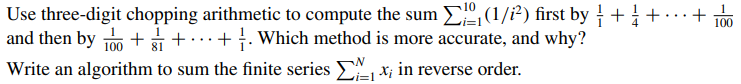
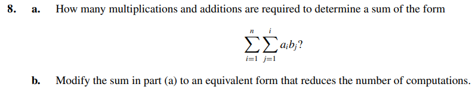
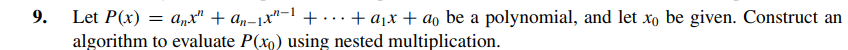
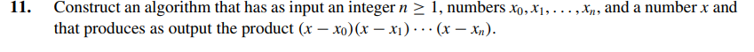
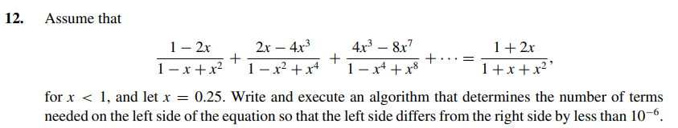
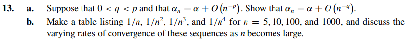
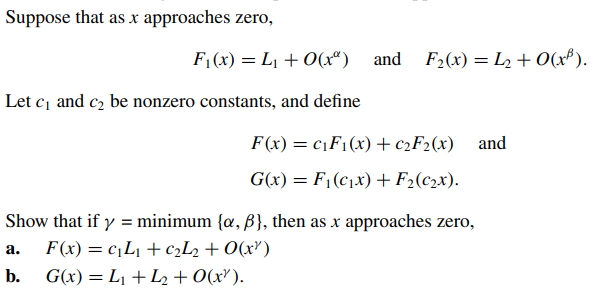

# Exercises:

Selecting the exercise number will redirect the page to the solution.

[Exercise 01](Ex_1/)

[Exercise 02](Ex_2/)

[Exercise 03](Ex_3/)

[Exercise 04](Ex_4/)

[Exercise 05](Ex_5/)

[Exercise 06](Ex_6/)

[Exercise 07](Ex_7/)

[Exercise 08](Ex_8/)

[Exercise 09](Ex_9/)

[Exercise 10](Ex_10/)

[Exercise 11](Ex_11/)

[Exercise 12](Exa_12/)

[Exercise 13](Exa_13/)

[Exercise 14](Exa_14/)

[Exercise 15](Exa_15/)

[Exercise 16](Ex_16/)

