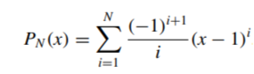
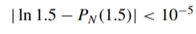
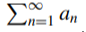
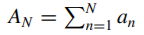
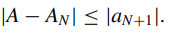

# Taylor Polynomial for Natural Logarithm Series
## Introduction
The Nth term of the Taylor Polynomial for the Natural Logarithm is:

The value of ln 1.5 to eight decimal places is 0.40546511. 
Let’s construct an algorithm to determine the minimal value of N required for:

From calculus we know that if 

 is an alternating series with limit A whose terms decrease in magnitude, then A and the Nth partial sum

differ by less than the magnitude of the (N + 1)st term; that is,

The following algorithm uses this bound for x = 1.5 and tolerance = 0.00001.
[algorithm](naturalLogTaylorSeries.c)
