# Exercises:

Selecting the exercise number will redirect the page to the solution.

[Exercise 01](ex01/)

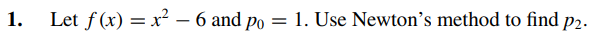

[Exercise 02](ex02/)

[Exercise 03](ex03/)

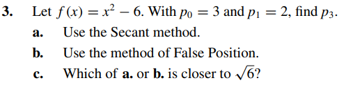

[Exercise 04](ex04/)

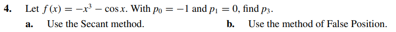

[Exercise 05](ex05/)

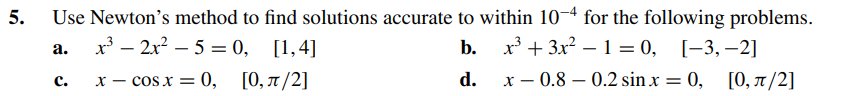

[Exercise 06](ex06/)

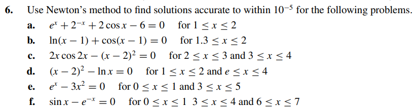

[Exercise 07](ex07/)

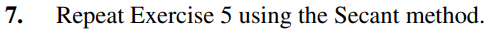

[Exercise 08](ex08/)

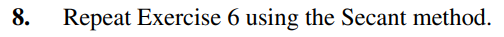

[Exercise 09](ex09/)

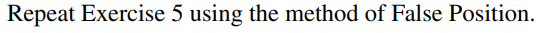

[Exercise 10](ex10/)

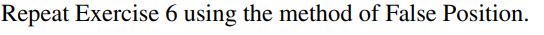

[Exercise 11](ex11/)

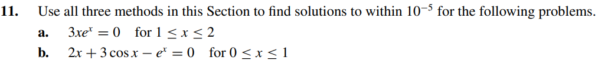

[Exercise 12](ex12/)

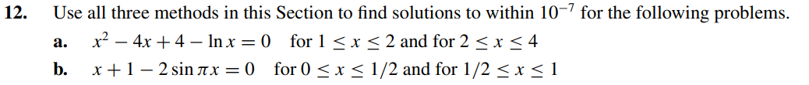

[Exercise 13](ex13/)

[Exercise 14](ex14/)

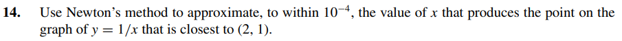

[Exercise 15](ex15/)

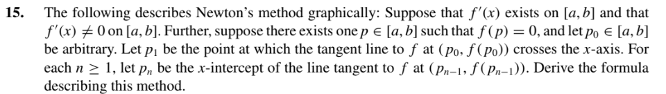

[Exercise 16](ex16/)

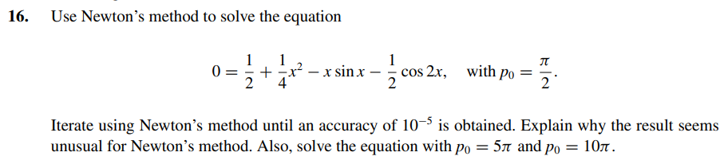

[Exercise 17](ex17/)

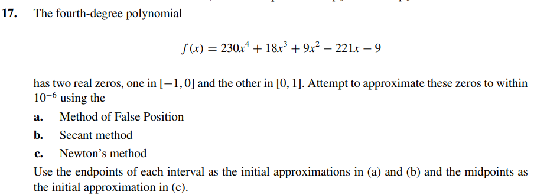

[Exercise 18](ex18/)

[Exercise 19](ex19/)

[Exercise 20](ex20/)

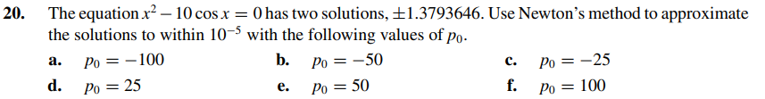

