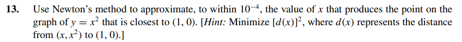

# Exercises:

Selecting the exercise number will redirect the page to the solution.

[Exercise 01](ex01/)

[Exercise 02](ex02/)

[Exercise 03](ex03/)

[Exercise 04](ex04/)

[Exercise 05](ex05/)

[Exercise 06](ex06/)

[Exercise 07](ex07/)

[Exercise 08](ex08/)

[Exercise 09](ex09/)

[Exercise 10](ex10/)

[Exercise 11](ex11/)

[Exercise 12](ex12/)

[Exercise 13](ex13/)

[Exercise 14](ex14/)

[Exercise 15](ex15/)

[Exercise 16](ex16/)

[Exercise 17](ex17/)

[Exercise 18](ex18/)

[Exercise 19](ex19/)

[Exercise 20](ex20/)

