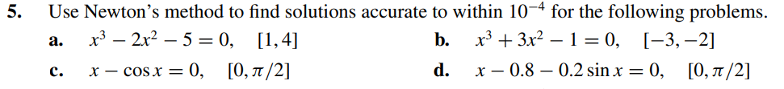
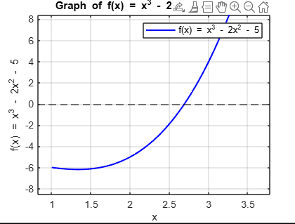
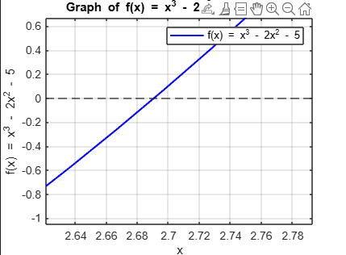
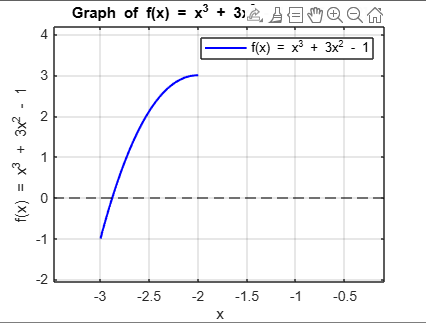
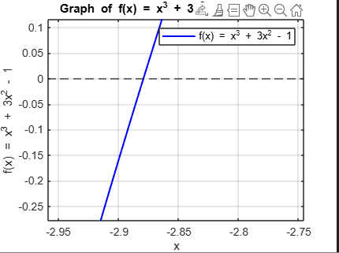
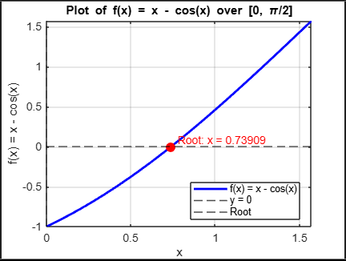
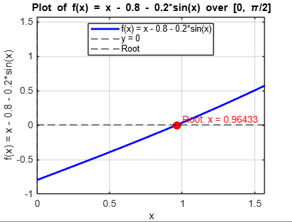

# Exercise 09

## Solution Letter A:

    - As we can see in the plots bellow, the solution must be between 2.5 and 3
    - The code for the algorithm implementation is [here](ex09a.c)

## Solution Letter B:

    - According to the plot, the root must be between -2.9 and -2.85
    - The code for the algorithm implementation is [here](ex09b.c)
    

## Solution Letter C:

    - The plot indicates that the root is approximately 1.75
    - The code for the algorithm implementation is [here](ex09c.c)

## Solution Letter D:

    - Based on the graph, the solution lies between 0.5 and 1.
    - The code for the algorithm implementation is [here](ex09d.c)

