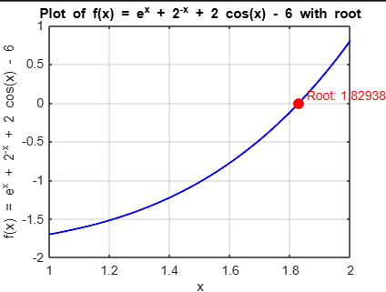
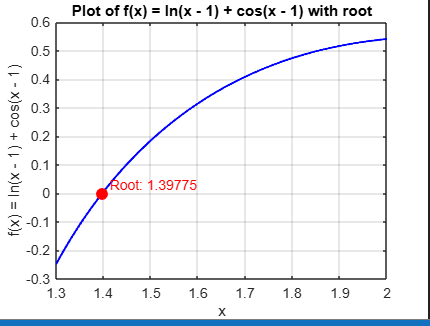
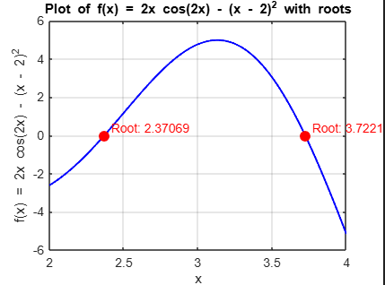
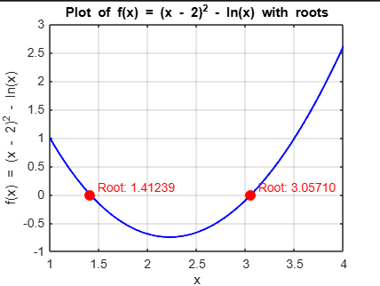
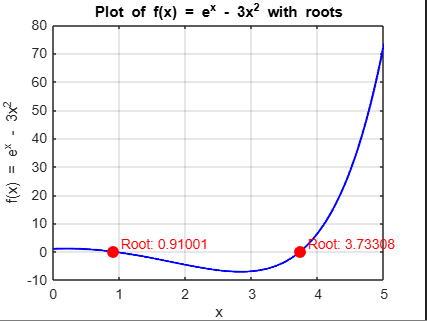
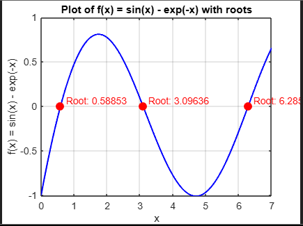

# Exercise 10

## Solution Letter A:

The plot indicates the correct value of the root
The code for the algorithm implementation is [here](ex10a.c)

## Solution Letter B:

The plot indicates the correct value of the root
The code for the algorithm implementation is [here](ex10b.c)

## Solution Letter C:

The plot indicates the correct value of the root
The code for the algorithm implementation is [here](ex10c.c)

## Solution Letter D:

The plot indicates the correct value of the root
The code for the algorithm implementation is [here](ex10d.c)

## Solution Letter E:

The plot indicates the correct value of the root
The code for the algorithm implementation is [here](ex10e.c)

## Solution Letter F:

The plot indicates the correct value of the root
The code for the algorithm implementation is [here](ex10f.c)

