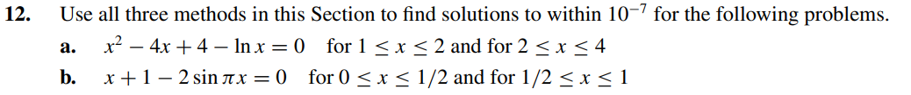

# Exercise 12:

## Solution Letter A:

We can see from the plot above that the equation has its root within [1,1.5] and [3,3.5]
The code with the methods implementation is [here](ex12a.c)

## Solution Letter B:

We can see from the plot above that the equation has its root close to 0.2 and 0.8
The code with the methods implementation is [here](ex12b.c)
