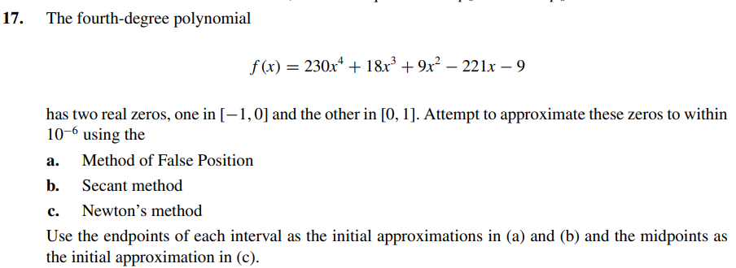

# Exercise 17 

According to the plot below:

The roots are: -0.0407 and 0.9624

Let's check if the algorithms give the same result -> [implementation here](ex17.c)

Output:
    Newton Method executed successfully after 3 iteractions
    Solution with Newton Method: -0.04066

    Newton Method executed successfully after 4 iteractions
    Solution with Newton Method for p0 = 0: 0.96240        

    Secant Method executed successfully after 5 iteractions
    Secant Method Solution for [-1,0]: -0.04066

    Secant Method executed successfully after 7 iteractions
    Secant Method solution for [-1,1]: 0.96240

    False Method Position executed successfully after 14 iteractions
    False Position Solution within [-1,0]: -0.04065

    False Method Position executed successfully after 8 iteractions
    False Position Solution within [0,1]: 0.96240