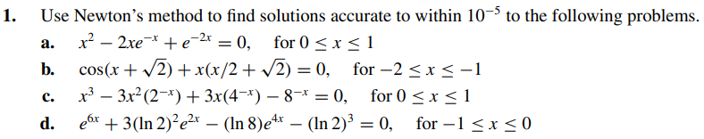
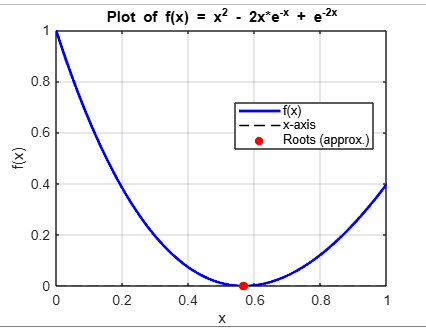

# Exercise 01

## Solution Analysis by the Plot:

The plot above shows that the solution is close to 0.6

## Solutions:

    - [Letter A](ex01a.c)
        
    - [Letter B](ex01b.c)
    - [Letter C](ex01c.c)
    - [Letter D](ex01d.c)
    - [Letter E](ex01e.c)