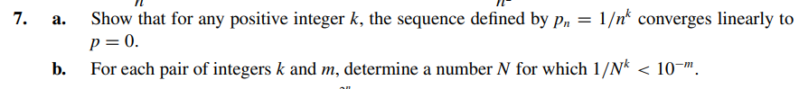

# Exercise 07

## Solution Letter A:

Given a sequence $\ p_{n} = 1 / n^{k}$ where $\ p \to 0$ when $\ n \to \infty$. The convergence will be linearly if and only if
$$
\ | p_{n+1} | \leq C \cdot | p_{n} |
$$

Where C is a positive constant less than 1( $\ C \leq 1$).

Let's prove for every k, in  $\frac{1}{n^k}$ that C will always be positive and less than 1.

$$
\ | \frac{1}{(n+1)^k}| \leq C \cdot | \frac{1}{n^k} |
$$

$$ 
\ | \frac{n^k}{(n+1)^k} | \leq C
$$

Taking the Kth root on both sides:

$$
\ | \frac{\sqrt[k]{n^k}}{\sqrt[k]{(n + 1)^k}} | = | \frac{n}{n+1} |  \leq \sqrt[k]{C}
$$

The fraction $\frac{n}{n+1}$ will give, as a result, a positive number less than 1. So:

$$
\frac{n}{n+1} \leq \sqrt[k]{C}
$$

That means $\sqrt[k]{C} < 1$ which also means C < 1 and $\ p_{n}$ converges linearly to p.

## Solution Letter B:
For a pair of integers m and k let's find N suchch that:

$$
\frac{1}{N^k} < 10^{(-m)}
$$

$$
\frac{1}{10^(-k)} < N^{k}
$$

$$
\ 10^m < N^{k}
$$

Raising both sides to the power of 1/k:

$$
\ N > 10^{m/k}
$$
