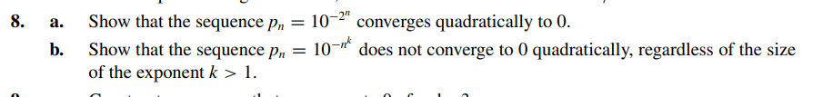

# Exercise 08

## Solution Letter A:
To prove that $\ p_{n} = 10^{-(2^n)}$ converges quadratically to 0 we have to show that $\alpha = 2$ such that:

$$
\ |\ p_{n+1} | \leq C \cdot | \ (p_{n})^{\alpha} |
$$

As $\ p_{n} = 10^{-(2^n)} = \frac{1}{10^{2^n}}$ , the equation becomes:

$$
\ | \frac{1}{10^{2^{n+1}}} | \leq C \cdot |\ p_{n}|^{\alpha}
$$

$$
\ | \frac{1}{10^{2^{n+1}}} | \leq C \cdot |\ p_{n}|^{\alpha}
$$

$$
\ | \frac{1}{10^{(2*2^n)}} | \leq C \cdot |\ p_{n}|^{\alpha}
$$

$$
\ | \frac{1}{(10^{2^{n}})^2} | \leq C \cdot |\ p_{n}|^{\alpha}
$$

$$
\ | (10^{-2^{n}})^{2} | \leq C \cdot |\ p_{n}|^{\alpha}
$$

$$
\ | p_{n} |^{2}  \leq C \cdot |\ p_{n}|^{\alpha}
$$

$$
\alpha = 2
$$

It's proven that the sequence converges quadratically as $\alpha = 2$
