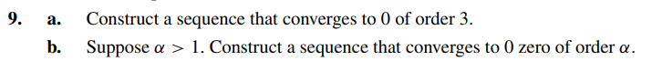

# Exercise 09

## Solution Letter A:

Let $\ p_{n} = 10^{-3^{n}}$. Then:

$$
| \ p_{n+1} | \leq C \cdot | p_{n} |^\alpha
$$

$$
| 10^{-3^{n+ 1}} | \leq C \cdot | p_{n} |^\alpha
$$

$$
| 10^{-3 \cdot 3^{n} } | \leq C \cdot | p_{n} |^\alpha
$$

$$
| (10^{-3^{n}})^{3} | \leq C \cdot | p_{n} |^\alpha
$$

$$
| p_{n} |^{3} \leq C \cdot | p_{n} |^\alpha
$$

$$
\   C = 1 , \alpha = 3
$$