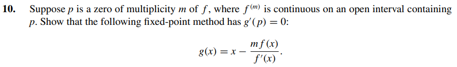

# Exercise 10

# Solution:

We have $\ g(x)$ and we want to show that $\ g'(p) = 0$.

$$
\ g(x) = x - \frac{m \cdot f(x)}{f'(x)}
$$

If $ \ p$ is a zero of multiplicity $ \ m$, then there is a function $ \ q(x)$ such that:

$$
\ f(x) = (x - p)^{m} \cdot q(x)
$$

With derivative:

$$
\ f'(x) = m \cdot (x - p)^{m - 1} \cdot q(x) + (x - p)^{m} \cdot q'(x)
$$

Replacing the expression above in $\ g(x)$, we would have the equation:

$$
\ g(x) = x - \frac{ m(x - p)^{m} \cdot q(x)}{m \cdot (x - p)^{m - 1} \cdot q(x) + (x - p)^{m} \cdot q'(x)} 
$$

Simplifying the expression by dividing all terms by $\ (x - p)^{m-1}$, the expression turns into:

$$
\ g(x) = x - \frac{m \cdot (x - p) \cdot q(x)}{m \cdot q(x) + (x - p) \cdot q'(x)}
$$

We want to show $\ g'(p) = 0$. So let's find $ \ g'(x)$ and apply it to the point $\ p$.
To do that, let's set the numerator as j(x) and denominator as k(x), so:

$$
\ j(x) = m \cdot (x - p) \cdot q(x)
$$

$$
\ j'(x) = m \cdot q(x) + m \cdot (x - p) \cdot q'(x)
$$
And $\ k(x)$

$$
\ k(x) = m \cdot q(x) + (x - p) \cdot q'(x)
$$

$$
\ k'(x) = m \cdot q'(x) + q'(x) + (x - p) \cdot q''(x) 
$$

Applying $\ j(x)$ and $\ k(x)$ to $\ g(x)$:

$$
\ g(x) = x - \frac{j(x)}{k(x)}
$$

Well, the derivative of $\ g(x)$ is:
$$
\ g'(x) = 1 - \frac{j(x) \cdot k'(x) + j'(x) \cdot k(x)}{k(x)^{2}}
$$

$$
\ g(x) =  1 - \frac{[m \cdot (x - p) \cdot q(x) \cdot m \cdot q'(x) + q'(x) + (x - p) \cdot q''(x)] + [m \cdot q(x) + m \cdot (x - p) \cdot q'(x) \cdot m \cdot q(x) + (x - p) \cdot q'(x)]}{(m \cdot q(x) + (x - p) \cdot q'(x))^{2}}
$$

$$
\ g'(p) = 1 - \frac{2 \cdot [m^{2} \cdot (p - p) \cdot q(p) \cdot q'(p) + m \cdot (p - p) \cdot q(p) \cdot q'(p)] + m^{2} \cdot q(p)^{2} + m \cdot q'(p) \cdot (p - p) \cdot [q(p) + (p - p) \cdot q'(p])}{(m \cdot q(p) + (p - p) \cdot q'(p))^{2}}
$$

$$
\ g'(p) = 1 - \frac{2 \cdot(0) + m^{2} \cdot q(p)^{2} + 0 \cdot(q(p) + 0)}{m^{2} \cdot q(p)^{2}}
$$

$$
\ g'(p) = 1 - \frac{m^{2} \cdot q(p)^{2}}{m^{2} \cdot q(p)^{2}}
$$

$$
\ g'(p) = 1 - 1 = 0
$$

It's proven that g'(p) = 0