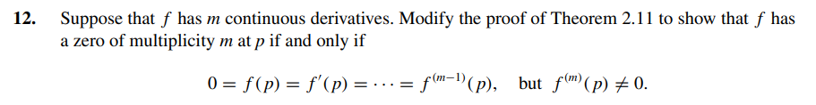

# Exercise 12

## Solution:

If  the function $ \ f$ has a zero of multiplicity m, then the function $\ f$ can be written as:

$$
\ f(x) = (x - p)^{m} \cdot q(x)
$$

But the $\ 1^{st}$ derivative of f is:
$$
\ f'(x) = m \cdot (x - p)^{m - 1} \cdot q(x) + (x - p)^{m} \cdot q'(x)
$$

And the $\ 2^{nd}$ derivative:
$$
\ f''(x) = m \cdot (m - 1) \cdot (x - p)^{m - 2} \cdot q(x) + m \cdot (x - p)^{m - 1} \cdot q'(x) + m \cdot (x - p)^{m - 1} \cdot q'(x) + (x - p)^{m} \cdot q''(x) = m \cdot (m - 1) \cdot (x - p)^{m - 2} \cdot q(x) + 2 \cdot m \cdot (x - p)^{m - 1} \cdot q'(x) + (x - p)^{m} \cdot q''(x)
$$

Notice that a term (x - p) \cdot m \cdot (m - 1)... will always be present. Actually, the general formula for the derivative is:

$$
f^{k}(x) = \sum_{j=0}^{k} \binom{k}{j} \frac{dj (x - p)^{m}}{dx^{j}} \cdot q^{k - j}(x)
$$

That gives $\ f'(p) = f''(p) = ... = f^{m-1}(p) = 0$.Because, there will always be an $\ (x - p)$. 

But for $\ k = m$:

$$
f^{k}(x) = m! \cdot (x - p)^{0} \cdot q(p)
$$

But at the beggining of this proof we defined $\ q(p) \neq 0$. So $\ f^{m} \neq 0$.

Then, we've proved:

$$
\ f'(p) = f''(p) = ... = f^{m-1}(p) = 0
$$

And 

$$
\ f^{k}(x) = m! \cdot (x - p)^{0} \cdot q(p) \neq 0
$$
