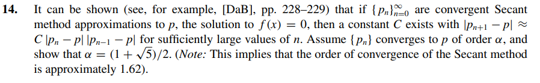
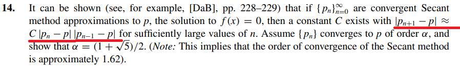

# Exercise 14

## Solution:

We know from the theory of the chapter that the order of convergence of an iterative method is $\alpha$ such that:

$$   
\lim_{n \to \infty} \frac{ | p_{n + 1} - p| }{| p_{n} - p |^\alpha} = \lambda       \quad (1) 
$$

Let $\ |e_{n} |$ be the $\ nth$ error of the iteraction. The value of $\ e_{n}$:
 
$$
\   e_{n} = | p_{n} - p |    \quad (2) 
$$

Replacing Equation(2) in Equation(1):

$$
\ \lim_{n \to \infty} \frac{ | e_{n+1} |}{| e_{n} |^\alpha} = \lambda  \quad(3)
$$

So for sufficiently large values of $\ n$ we have:

$$
| e_{n+1} | = \lambda \cdot | e_{n} |^\alpha    \quad(4)
$$

Making adaptations in the Equation (3):

$$
\ \lim_{n \to \infty} \frac{ | e_{n} | }{ | e_{n-1} |^\alpha } = \lambda
$$

$$
\ \lim_{n \to \infty} \frac{| e_{n-1}^\alpha|}{| e_{n} |} = \lambda^{-1}
$$

$$
\ \lim_{n \to \infty} |e_{n-1}|^\alpha =   | e_{n} | \cdot \lambda^{-1}
$$

$$
\ \lim_{n \to \infty} |e_{n - 1} | = \lambda^{ \frac{-1}{\alpha}} \cdot | e_{n} |^{ \frac{1}{\alpha}}
$$

So, for sufficiently large values of $\ n$, we have:

$$
|e_{n - 1} | = \lambda^{ \frac{-1}{\alpha}} \cdot | e_{n} |^{ \frac{1}{\alpha}}    \quad(5) 
$$

However, the question tile told us that:

Therefore:

$$
\ |p_{n+1}| = C \cdot | p_{n} - p | \cdot | p_{n-1} - p |
$$

$$
\begin{equation}
\ |e_{n+1}| = C \cdot |e_{n}| \cdot |e_{n-1}| 
\end{equation}
$$

But from Equation (4) we know that 

$$
\ |e_{n+1}| = |e_{n}|^\alpha \cdot \lambda
$$

And from Equation (5) we know 

$$
|e_{n - 1} | = \lambda^{ \frac{-1}{a}} \cdot | e_{n} |^{ \frac{1}{a}}
$$

So Equation (6) becomes:

$$
\ |e_{n+1}| = C \cdot |e_{n}| \cdot |e_{n-1}|
$$

$$
\ |e_{n}|^\alpha \cdot \lambda = C \cdot |e_{n}| \cdot  \lambda^{ \frac{-1}{\alpha}} \cdot | e_{n} |^{ \frac{1}{\alpha}}
$$

$$
\ |e_{n}| ^\alpha = C \cdot \lambda^{\frac{-1}{\alpha - 1}} \cdot|e_{n}|^{1 + \frac{1}{\alpha}}
$$

The exponents of $\ |e_{n}|$ must be equal, so:

$$
\alpha = 1 + \frac{1}{\alpha}
$$

Multiplying both sides by $\alpha$, we'd have:

$$
\alpha^{2} - \alpha - 1 = 0
$$

Solving the quadratic equation above, we'd find:

$$
\alpha = \frac{1 + \sqrt{5}}{2}
$$
