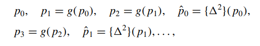
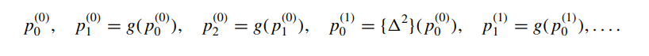
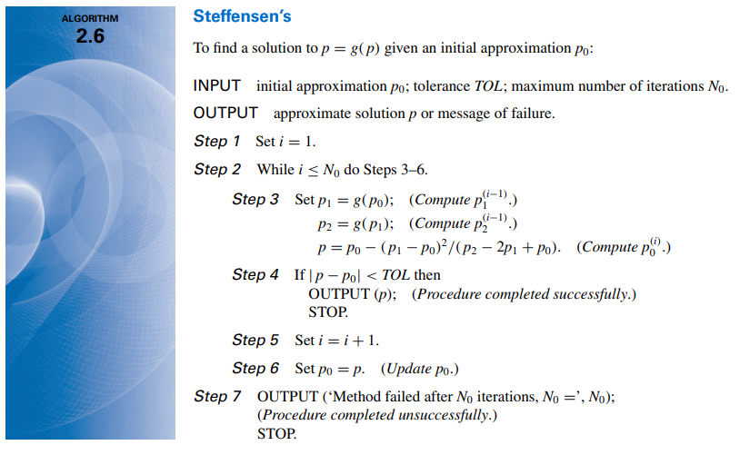

# Accelerating Convergence

This section explores how to make a linear convergent method faster using a method called $\ Aitken's  \Delta^{2}  Method$ 

## Aitken's Method

Let $\ \{p_{n}\}_{n = 0} ^{\infty}$ be a sequence that satisfies:

$$
 \frac{(p_{n+1} - p)}{(p_{n} - p)} \approx \frac{(p_{n+2} - p)}{p_{n+1} - p}
$$

Doing the cross multiplication:

$$
(p_{n+1} - p)^{2} \approx (p_{n+2} - p) \cdot (p_{n} - p)
$$

Expanding the notable product on the left side:

$$
(p_{n+1}^{2} - 2 \cdot p_{n+1} \cdot p + p^{2}) \approx p_{n+2} \cdot p_{n} - p \cdot p_{n+2} - p_{n} \cdot p + p^{2}
$$

Isolating every "$ p-factor$" on the left side:

$$
p \cdot p_{n+2} + p \cdot p_{n} - 2 \cdot p_{n+1} \cdot p \approx p_{n} \cdot - p_{n+1}^{2}
$$

Factoring the left side:

$$
p \cdot (p_{n+2} + p_{n} - 2 \cdot p_{n+1}) \approx p_{n} \cdot p_{n+2} - p_{n+1}^{2}
$$

Which will we give us:

$$
p \approx \frac{p_{n} \cdot p_{n+2} - (p_{n+1})^{2}}{p_{n+2} + p_{n} - 2 \cdot p_{n+1}}
$$

$ 
\text{So the sequence } \{ \hat{p}_n \}_{n=0}^\infty \text{is  defined  by  the  term}
$

$$
\hat{p}_n = \frac{p_{n} \cdot p_{n+2} - (p_{n+1})^{2}}{p_{n+2} + p_{n} - 2 \cdot p_{n+1}}
$$

## Alternative Formula for Aitken's Method( $\Delta p_{n}$)

### Definition: 
The $\Delta$ (it is read 'delta p_{n}) is calculated by the difference between the next term ($ p_{n+}$) and the current term ($p_{n}$). As it's shown bellow:

$$
\Delta p_{n} = p_{n+1} - p_{n}
$$

The 'n-powered' $\Delta$ is measured recursively:

$$
\Delta^{k} p_{n} = \Delta( \Delta^{k - 1} p_{n})
$$

For example:

$$
\Delta^{2} p_{n} = \Delta(\Delta^{2 - 1 = 1} p_{n})
$$

$$
\Delta^{2} p_{n} = \Delta(p_{n+1} - p_{n})
$$

$$
\Delta^{2} p_{n} = \Delta p_{n+1} - \Delta p_{n}
$$

$$
\Delta^{2} p_{n} = p_{n+2} - p_{n+1} - (p_{n+1} - p_{n})
$$

$$
\Delta^{2} p_{n} = p_{n+2} - 2 \cdot p_{n+1} + p_{n}
$$

So the $\text{Aitken's} \Delta^{2} \text{Method}$ can be calculated in function of $\Delta p_{n}$:

$$
\hat{p}_{n} = p_{n} - \frac{(p_{n+1} - p_{n}) ^{2}}{p_{n+2} - 2 \cdot p_{n+1} + p_{n}}
$$

## Steffesen's Method:

Aitken's method works like this:

Supposing that $ \hat{p_{0}}$ is a better approximation to $p_{0}$, the sequence generated by Steffensen's Method is like:

Step1: We generate $p_{1}$ and $p_{2}$
Step2: Compute $ \hat{p_{0}}$ and repeat step 1, but use $ \hat{p_{0}}$ as the new value of $p_{0}$ until we find $p$

### Steffensen's Algorithm:

# Exercises:

As usual, here are the [exercises](exercises/) of this section solved in Markdown or C language.