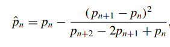
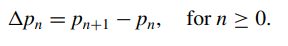
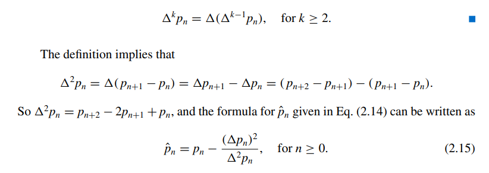

# Accelerating Convergence

This section explores how to make a linear convergent method faster using a method called $\ Aitken's  \Delta^{2}  Method$ 

## Aitken's Method

The $\ nth$ term of the sequence by Aitken's method is:

## Alternative Formula for Aitken's Method( $\Delta p_{n}$)

### Definition: 

## Steffesen's Method:

Aitken's method works like this:

Supposing that Aitken's term is a better approximation to $p_{0}$, the sequence generated by Steffensen's Method is like:

### Steffensen's Algorithm:

# Exercises:

As usual, here are the [exercises](exercises/) of this section solved in Markdown or C language.
