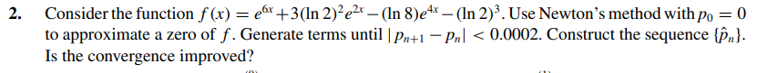

# Exercise 02

## Solution:

The following [code](ex02.c) gave the output below:

Newton's Method:
Iteration 1: p = -0.051142137
Iteration 2: p = -0.089842476
Iteration 3: p = -0.118244736
Iteration 4: p = -0.138565596
Iteration 5: p = -0.152816193
Iteration 6: p = -0.162660253
Iteration 7: p = -0.169386176
Iteration 8: p = -0.173946064
Iteration 9: p = -0.177020814
Iteration 10: p = -0.179086455
Iteration 11: p = -0.180470677
Iteration 12: p = -0.181396689
Iteration 13: p = -0.182015461
Iteration 14: p = -0.182428615
Iteration 15: p = -0.182704335
Newton Method Success after 16 iterations
Solution: -0.182888275

Aitken's Δ² Acceleration Method:
Iteration 1: Aitken_p = -0.183256665
Iteration 2: Aitken_p = -0.183132777
Aitken's Method Success after 2 iterations
Solution: -0.183132777