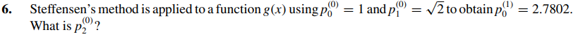

# Exercise 6

## Solution:

The Steffensen's Method uses the Sequence:
$$
    P_{0}^{1} = P_{0}^{(0)} - \frac{(P_{1}^{(0)} - P_{0}^{(0)})^{2}}{(P_{2}^{(0)} -2 \cdot P_{1}^{(0)} + P_{0}^{(0)})}
$$

Replacing the values given by the question:
$$
    2.7802 = 1 - \frac{( \sqrt{2} - 1)^{2}}{(P_{2}^{(0)}- 2 * \sqrt{2} + 1)}
$$

The result...

$$
P_{2}^{(0)} = 2 \cdot \sqrt{2} - 1 
$$