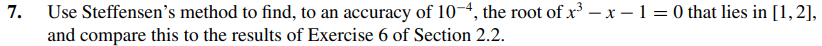
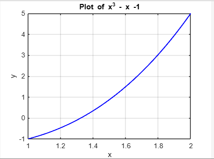

# Exercise 07

## Solution:
The plot of the function shows us that the root must be between 1.2 and 1,4:

The following code ---> [ex07.c](ex07.c) gave the output bellow:

    -   Stefensen Method Success(11 iteractions)
    -   Solution(Root): 1.32472