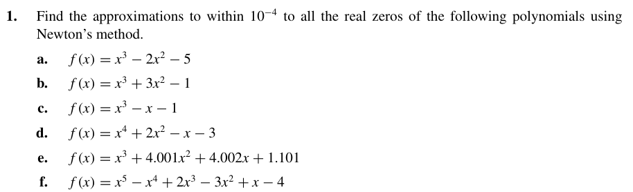

# Exercise 01

- [Solution Letter A:](ex01a/)
- [Solution Letter B:](ex01b/)
- [Solution Letter C:](ex01c/)
- [Solution Letter D:](ex01d/)
- [Solution Letter E:](ex01e/)
- [Solution Letter F:](ex01f/)