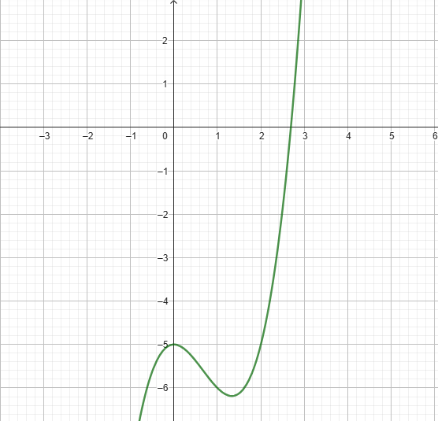

# Exercise 1a

As the plot bellow shows, the root of the equation must be between 2 and 3

The *[code in C language that solves the exercises is here](ex01a.c)*

Output:
  Newton Method Executed Successfully after 13 iteractions
  Root of the equation: 2.69065
