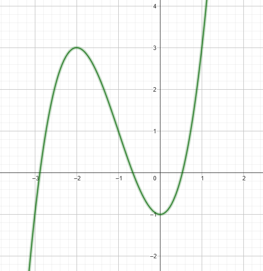

# Exercise 1b

As the plot bellow shows, the root of the equation must be between 0 and 1

Output of the *[code in C language](ex01b.c)*:
    Newton Method Executed Successfully after 5 iteractions
    Root of the equation between 0 and 1: 0.53209

    Newton Method Executed Successfully after 3 iteractions
    Root of the equation between 0 and -1: -0.65270