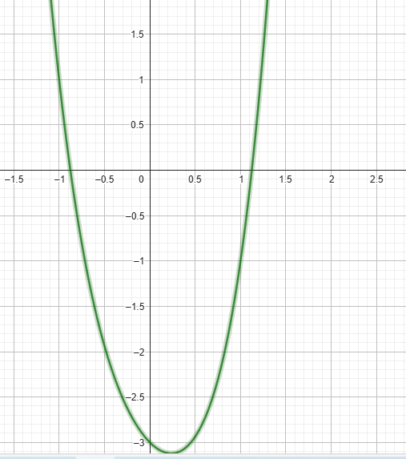

# Exercise 1d

As the plot bellow shows, the root of the equation must be between 1 and 1.5

Output of the *[code in C language that solves the exercise(click here)](ex01d.c)*:
    
    Newton Method Executed Successfully after 5 iteractions
    Root of the equation between 0 and 1.5 for p0 = 1.00000: 1.30490