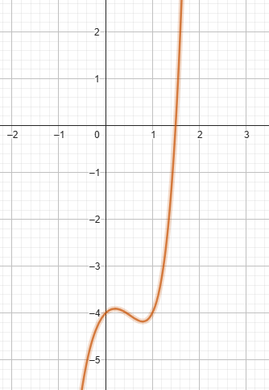

# Exercise 1f

As the plot bellow shows, the root of the equation must be between 1 and 2

Output of the *[code in C language that solves the exercise(click here)](ex01f.c)*:
    
    Newton Method Executed Successfully after 15 iteractions
    Root of the equation for p0 = 0.50000: 1.49819